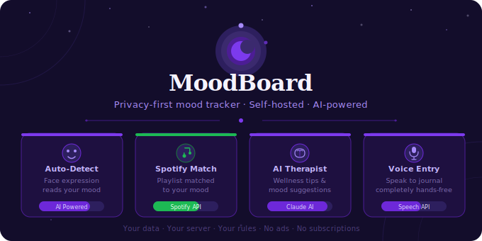

```markdown
<div align="center">



</div>
# MoodBoard

**Your daily mood companion — private, self-hosted, AI-powered.**

[](https://github.com/amanrai05/Mood-Board/blob/main/LICENSE)
[](https://github.com/amanrai05/Mood-Board/stargazers)
[](https://github.com/amanrai05/Mood-Board/commits/main)
[](https://react.dev)
[](https://flask.palletsprojects.com)

<br/>

> Track your mood. Journal your thoughts. Let AI do the rest.

<br/>

</div>

---

## ✨ What is MoodBoard?

MoodBoard is a **privacy-first, open-source mood tracker and daily journal** you can self-host in minutes. No ads. No subscriptions. No data mining. Just you and your data — on your own server.

Inspired by Daylio. Built for people who care about their mental wellness *and* their privacy.

---

## 🚀 Features

### Core

| | Feature | Description |
|---|---|---|
| 📊 | **Mood Tracking** | Log daily mood on a 5-point scale with customizable tags |
| 📝 | **Rich Journaling** | Full Markdown support in every entry |
| 📅 | **Analytics** | Calendar view, mood trends, streaks & stats |
| 🎯 | **Goals** | Set personal goals and track progress |
| 🏆 | **Achievements** | Gamified milestones to keep you consistent |
| 🔒 | **Privacy First** | Local SQLite only — zero telemetry, zero tracking |
| 🐳 | **Docker Ready** | One command and you're live |

---

### 🤖 AI Features

<br/>

<div align="center">

| 🎭 Auto-Detect | 🎵 Spotify Match | 🧠 AI Therapist | 🎙️ Voice Entry |
|:---:|:---:|:---:|:---:|
| Camera reads your facial expression and auto-logs your current mood — no manual input needed | Recommends a Spotify playlist that perfectly matches your mood the moment you log it | Get personalized mental wellness suggestions and compassionate responses based on how you feel | Speak your thoughts out loud — voice is transcribed to text so you can journal completely hands-free |

</div>

<br/>

---

## 📸 Preview

> Dashboard — AI features visible at the top: Auto-Detect · Spotify Match · AI Therapist · Voice Entry


---

## ⚡ Quick Start

> **Note:** Runs in single-user mode by default. Enable Google OAuth for multi-user support.

```bash
# 1. Clone
git clone https://github.com/amanrai05/Mood-Board.git
cd Mood-Board

# 2. Create config
cp .env.docker .env

# 3. Set your secrets (open .env → update SECRET_KEY and JWT_SECRET)
nano .env

# 4. Launch
docker compose up -d
```

> App live at **http://localhost:5173** 🎉

---

## 💻 Local Development

**Requirements:** Node.js v18+ · Python v3.11+

```bash
# Frontend
npm install
npm run dev                        # → http://localhost:5173

# Backend (new terminal)
cd api
python -m venv venv
source venv/bin/activate           # Windows: venv\Scripts\activate
pip install -r requirements.txt
cd ..
npm run api:dev
```

---

## ⚙️ Configuration

### Backend (`.env`)

| Variable | Description |
|---|---|
| `SECRET_KEY` | Long random string for session security |
| `JWT_SECRET` | Secret for JWT token signing |
| `DATABASE_PATH` | SQLite path (default: `/app/data/moodboard.db`) |
| `ENABLE_GOOGLE_OAUTH` | `1` to enable · `0` to disable |
| `CORS_ORIGINS` | Your frontend domain |
| `GOOGLE_CLIENT_ID` | Google OAuth client ID (if enabled) |
| `GOOGLE_CLIENT_SECRET` | Google OAuth secret (if enabled) |
| `SPOTIFY_CLIENT_ID` | Spotify API client ID (for Spotify Match) |
| `SPOTIFY_CLIENT_SECRET` | Spotify API secret (for Spotify Match) |

### Frontend (`.env`)

| Variable | Description |
|---|---|
| `VITE_API_URL` | Backend URL (local dev only) |
| `VITE_GOOGLE_CLIENT_ID` | Google OAuth client ID (if enabled) |
| `VITE_SPOTIFY_CLIENT_ID` | Spotify client ID (for Spotify Match) |

---

## 🛠️ Tech Stack

| Layer | Tech |
|---|---|
| **Frontend** | React 19 + Vite · served by Nginx |
| **Backend** | Flask (Python) · JSON REST API |
| **Database** | SQLite · auto-migrations on startup |
| **Auth** | JWT · optional Google OAuth |
| **AI — Face Detect** | MediaPipe / face-api.js |
| **AI — Therapist** | Claude API (Anthropic) |
| **AI — Voice Entry** | Web Speech API |
| **Music** | Spotify Web API |
| **Deploy** | Docker Compose · Nginx + TLS |

---

## 📡 API Reference

All protected endpoints require `Authorization: Bearer <jwt>`

**Auth**
```
POST  /api/auth/local/login
POST  /api/auth/google
POST  /api/auth/verify
```

**Moods**
```
POST   /api/mood
GET    /api/moods?start_date=YYYY-MM-DD&end_date=YYYY-MM-DD
GET    /api/mood/:id
PUT    /api/mood/:id
DELETE /api/mood/:id
GET    /api/statistics
GET    /api/streak
```

**Tags**
```
GET    /api/groups
POST   /api/groups
POST   /api/groups/:id/options
DELETE /api/groups/:id
DELETE /api/options/:id
```

**Achievements**
```
GET   /api/achievements
POST  /api/achievements/check
```

---

## 🌐 Self-Hosting with TLS

```bash
git clone https://github.com/amanrai05/Mood-Board.git
cd Mood-Board
cp .env.docker .env
# Edit .env — set your domain + strong secrets
docker compose -f docker-compose.prod.yml up -d
```

Place TLS certs in `./ssl/` → `fullchain.pem` + `privkey.pem`
Nginx serves on ports **80** and **443**

---

## 🤝 Contributing

PRs are welcome! For major changes, open an issue first.

```bash
npm test    # runs backend tests via pytest
```

---

## 📄 License

[AGPL-3.0](https://github.com/amanrai05/Mood-Board/blob/main/LICENSE) · Made with 🌙 by [amanrai05](https://github.com/amanrai05)
```

Copy all → paste into `README.md` → commit. Done.
